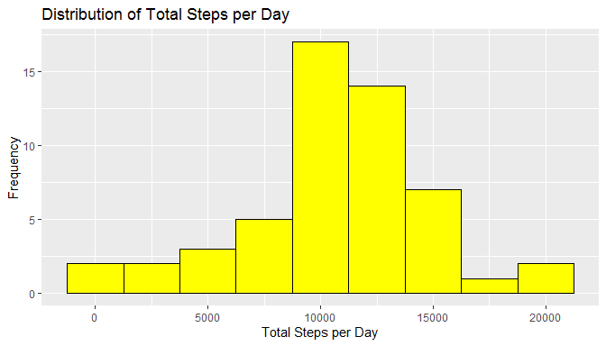
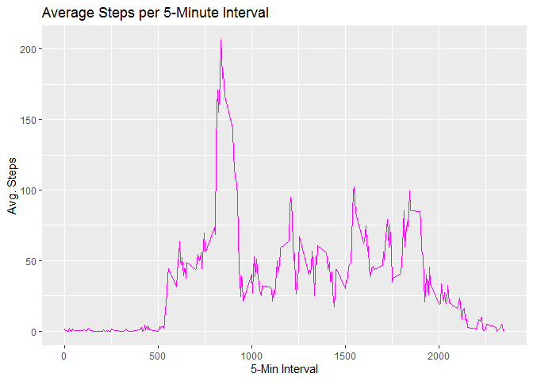
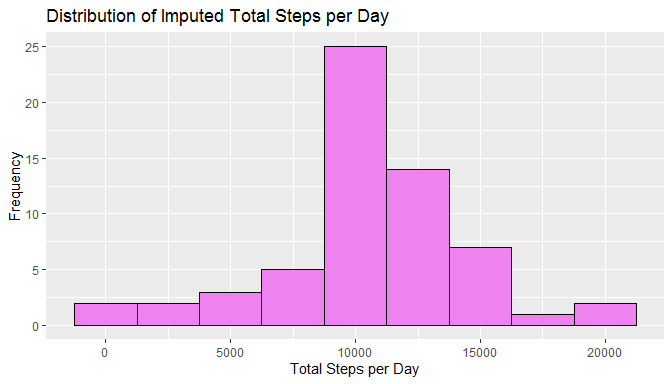
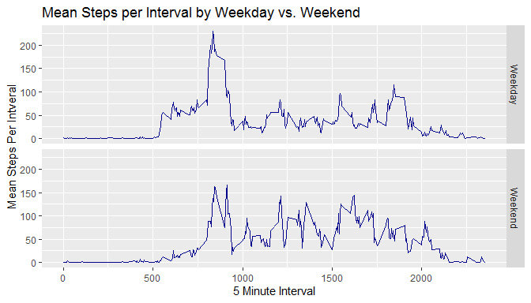

Libraries used in analysis, beyond basic RStudio package:  
1. dpylr  
2. magrittr  
3. xtable
4. ggplot2  


## Loading and preprocessing the data

Unzip file from repository and read .csv file into R

```r
a.0 <- read.csv(unzip("./activity.zip", exdir = "./activity"))
```
Preview data

```r
head(a.0)
```

```
##   steps       date interval
## 1    NA 2012-10-01        0
## 2    NA 2012-10-01        5
## 3    NA 2012-10-01       10
## 4    NA 2012-10-01       15
## 5    NA 2012-10-01       20
## 6    NA 2012-10-01       25
```

```r
str(a.0)
```

```
## 'data.frame':	17568 obs. of  3 variables:
##  $ steps   : int  NA NA NA NA NA NA NA NA NA NA ...
##  $ date    : chr  "2012-10-01" "2012-10-01" "2012-10-01" "2012-10-01" ...
##  $ interval: int  0 5 10 15 20 25 30 35 40 45 ...
```

Data appears tidy, however, dates, as loaded are object: character. These values will be converted to object:dates.

```r
a.0$date <- as.Date(a.0$date, "%Y-%m-%d")
```
## What is mean total number of steps taken per day?
Original data frame is to grouped by day, and summarized by total steps per day


```r
a.date <- group_by(a.0, date) %>% 
      summarise(total = sum(steps, nm.ra = TRUE))
```


```r
g <- ggplot(a.date, aes(total))
g + geom_histogram(binwidth = 2500, col = "black", fill = "yellow") + labs(x = "Total Steps per Day", y = "Frequency", title = "Distribution of Total Steps per Day")
```

<!-- -->

From above histogram, it appears that mean and median of total steps per day should be in the 10000/day range.    

Mean Steps Per Day =

```r
mean(a.date$total, na.rm = TRUE)
```

```
## [1] 10767.19
```
Median Steps Per Day =

```r
median(a.date$total, na.rm = TRUE)
```

```
## [1] 10766
```

## What is the Average Daily Pattern?  
Group a.0 by interval and summarize total steps per interval(288 total intevals)


```r
a.int <- group_by(a.0, interval) %>%
      summarise(steps.by.int = mean(steps, na.rm = TRUE))
```

Because interval is sequential (equivalent to 24hr time), plotting interval vs average steps taken is equivalent to a time series plot

```r
g <- ggplot(a.int, aes(x = interval, y =steps.by.int))
g + geom_line(col = "magenta", size = 0.5) + labs(x = "5-Min Interval", y = "Avg. Steps", title = "Average Steps per 5-Minute Interval")
```

<!-- -->

From the plot, you can see that average steps hits a maximum around 8000 to 9000 interval, which equates to 8:00 a.m. to 9:00 a.m.

To find actual 5 minute interval with highest average value (the most active interval):

```r
a.int[grepl(max(a.int$steps.by.int), a.int$steps.by.int), ]
```

```
## # A tibble: 1 x 2
##   interval steps.by.int
##      <int>        <dbl>
## 1      835         206.
```
So interval that, on average, has the maximum steps is 835 (equivalent to 8:35 to 8:40 a.m.) where total steps taken averaged to 206.

## Imputing missing values
There are 2304 missing values in the data set.

```r
sum(is.na(a.0))
```

```
## [1] 2304
```

To impute missing values for any day, the mean value of that interval for all days will be inserted.  To do this:  
1.) A named vector (dict) of interval/mean pairs will be created from the data frame created for the previous question (a.int)   
2.) Original data frame (a.0) will be mutated create a new variable, steps.i.  Non-NA values from steps will be passed to this variable, NA values will be replaced by the given intervals mean value  
3.) A new unique, imputed data frame will be created using select(a.i)  

```r
dict <- a.int$steps.by.int
names(dict) <- a.int$interval
a.1 <- mutate(a.0, steps.i=ifelse(is.na(steps), dict[as.character(interval)],steps))
a.i <- select(a.1, steps.i, 2:3)
```

How does imputing the data set effect the distribution of total steps per day and the mean and median of total steps per day?

```r
a.date.i <- group_by(a.i, date) %>% 
      summarise(total = sum(steps.i, nm.ra = TRUE))
```


```r
g <- ggplot(a.date.i, aes(total))
g + geom_histogram(binwidth = 2500, col = "black", fill = "violet") + labs(x = "Total Steps per Day", y = "Frequency", title = "Distribution of Imputed Total Steps per Day")
```

<!-- -->

Mean Steps Per Day(with imputed values) =

```r
mean(a.date.i$total, na.rm = TRUE)
```

```
## [1] 10767.19
```
Median Steps Per Day =

```r
median(a.date.i$total, na.rm = TRUE)
```

```
## [1] 10767.19
```
Mean and median values have not changed.  However, from the histogram, the frequency of total values near the mean has increased.  So imputing values did not significantly effect the estimate of total average steps per day.  

## Are there differences in activity patterns between weekdays and weekends?
First, mutate the imputed dataset, so that each day is assigned to its segment of the week, either weekend or weekday

```r
a.i.dw <- mutate(a.i, Day.Of.Week = factor((weekdays(a.i$date) %in% c("Saturday","Sunday")), labels = c("Weekday", "Weekend")))
```

Next, create a new data frame that composed of average steps per day per interval from the imputed dataset

```r
a.i.int <- group_by(a.i.dw, interval, Day.Of.Week) %>%
      summarize(mean.steps.i = mean(steps.i, na.rm = TRUE))
```

Is there a difference in activity between weekdays and weekends?

```r
l <- ggplot(a.i.int, aes(x=interval, y = mean.steps.i))
l + geom_line(col = "dark blue", size = 0.5)+ facet_grid(Day.Of.Week~.) + labs(x = "5 Minute Interval", y = "Mean Steps Per Intveral", title = "Mean Steps per Interval by Weekday vs. Weekend")
```

<!-- -->

Plots are very similar but different.  Things of note:  
1.) Activity on weekends does not have as clear of a start time  
2.) Period of highest activity is still the same  
3.) Movement through the rest of the day is much more   distributed on weekends, and generally appear to move more   
4.) Peak movement on weekends is less
